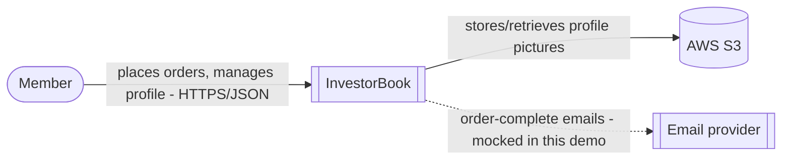
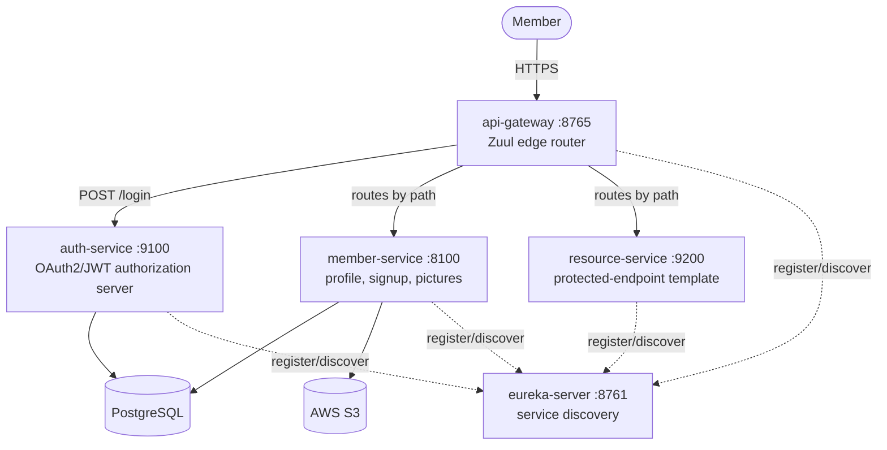
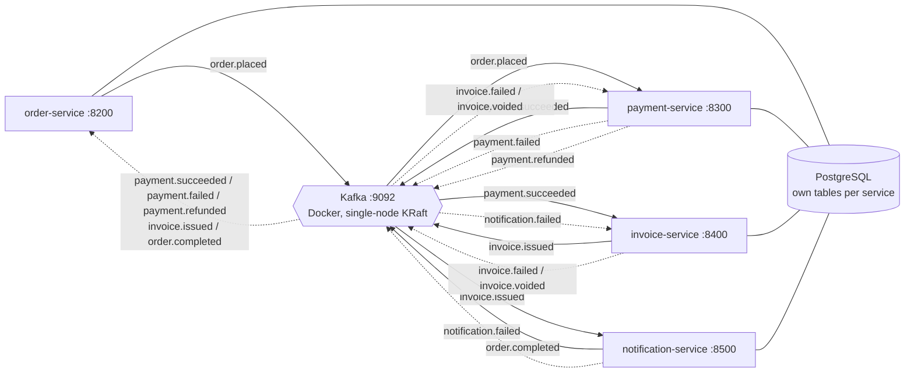
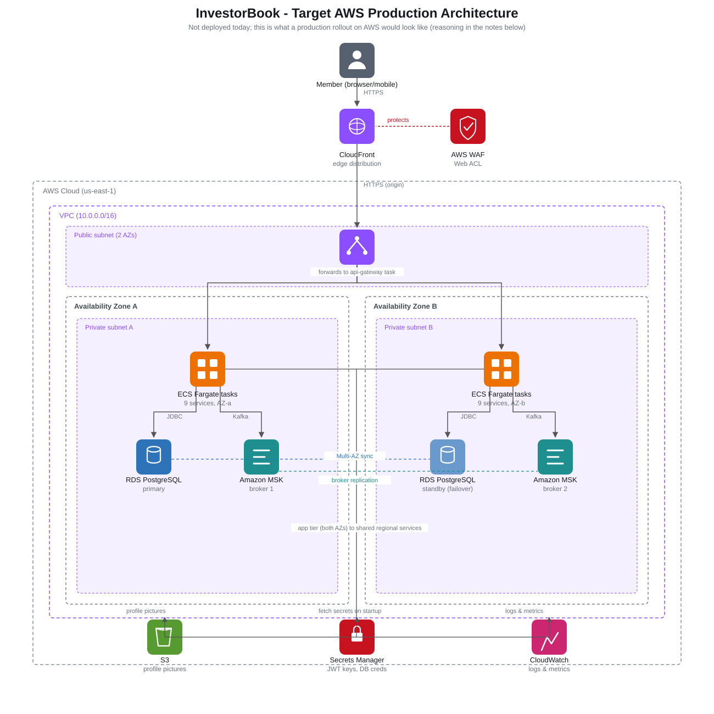

# InvestorBook

A Spring Cloud microservices demo modeling a social network for investors: service discovery,
an OAuth2/JWT authorization server, an API gateway, a member-profile service with S3-backed
picture upload, and a choreographed, event-driven purchase saga over Kafka. Nine independently
deployable modules plus a shared library, no parent POM.

Started as an untested prototype that didn't compile from a clean checkout. Now: real
integration tests (Testcontainers Postgres/Kafka, LocalStack S3), a hardened error/resilience
layer, an event-driven saga with compensating actions for every step, and a clean security scan across
every module. See [`CLAUDE.md`](CLAUDE.md) for full architecture detail, per-module quirks, and
commands; [`docs/adr/`](docs/adr/) for the decisions behind it.

## Architecture

### System context



### Containers, core services



Zuul and Eureka (Netflix OSS) are both in maintenance mode; they're kept here because they're what
the original code used. A new microservices system built today would use Spring Cloud Gateway and
Kubernetes-native discovery (DNS-based Service resolution) instead; see
[ADR-001](docs/adr/001-service-discovery-and-gateway.md) for the full reasoning.

### Containers, event-driven purchase flow

Choreographed over Kafka, a single-node broker in KRaft mode (the `apache/kafka:3.7.0` Docker
image, port 9092, started via `docker compose up -d`); no service calls another directly, they
only publish/consume through it. See [ADR-005](docs/adr/005-event-driven-choreography.md) and
[ADR-006](docs/adr/006-kafka-vs-queue.md):



Dashed edges are the compensation paths. When a step after payment fails, the saga unwinds
backwards instead of leaving the customer charged for an order that never completes:

```
invoice-service fails    InvoiceFailed -----------------------------> payment-service refunds --PaymentRefunded--> order CANCELLED
notification fails       NotificationFailed --> invoice-service voids --InvoiceVoided--> payment-service refunds --PaymentRefunded--> order CANCELLED
```

`order-service` consumes five topics (it tracks overall order status), `payment-service` three
(the order, plus the two events that mean a refund is due), `invoice-service` two, and
`notification-service` one.

### Target AWS deployment

Nothing here runs on AWS today except S3 (and LocalStack for that in tests); everything else runs
locally. This is what a production rollout would map onto, across two Availability Zones, one AWS
managed service per piece of local infrastructure this repo already depends on, not a redesign:



Fargate over EKS, one Multi-AZ RDS instance over per-service databases, MSK over self-hosted
Kafka, CloudFront+WAF at the edge, why 2 AZs: the reasoning behind each is in
[ADR-009](docs/adr/009-aws-deployment-architecture.md), including what this diagram deliberately
doesn't claim (no auto-scaling policy, no multi-region failover, no CI/CD pipeline).

## Highlights

- **A real bug only an integration test could catch**: signup crashed on any member with an
  address (`@MapsId` cascade needs the back-reference set first), invisible to every mocked
  unit test, caught the moment a real-Postgres test exercised it.
- **A shared error handler with a real, hidden bug**: wiring it into every service surfaced a
  catch-all that was silently turning every `@PreAuthorize` denial into a 500 instead of a 403,
  fixed, and proven with a regression test.
- **A circuit breaker on a real failure mode**: member-service's signup callback to auth-service
  degrades gracefully (202, log in separately) instead of a 500, with a test proving the circuit
  actually opens and short-circuits, not just that one failure returns a fallback.
- **A saga with real compensating actions**: a declined payment cancels the order rather than
  leaving it stuck, and a failure after payment (invoice not issued, customer unreachable) voids
  the invoice, refunds the payment, and cancels the order. See
  [ADR-008](docs/adr/008-saga-compensation.md) and [ADR-010](docs/adr/010-compensation-after-payment.md).
- **Idempotent consumers, two different ways**, each proven against a real duplicate delivery.
  See [ADR-007](docs/adr/007-idempotency-strategy.md).
- **A security scan that found real bugs**: wiring SpotBugs/FindSecBugs into every module (it was
  only in one) turned up a mutable `Date` exposed by reference, a default-encoding footgun in an
  OAuth2 Basic-auth header, CRLF log-injection on Kafka payload fields, and more, fixed, not
  suppressed. Full list in `CLAUDE.md`'s "Security scanning" section.

## Services

| Service | Port | Purpose |
|---|---|---|
| `eureka-server` | 8761 | Service discovery |
| `auth-service` | 9100 | OAuth2/JWT authorization server |
| `member-service` | 8100 | Signup, profile, S3 picture upload |
| `resource-service` | 9200 | Template for a new protected service |
| `api-gateway` | 8765 | Zuul edge router, the only externally-called service |
| `order-service` | 8200 | Places orders, owns order status (including `CANCELLED` after a refund) |
| `payment-service` | 8300 | Mocked, deterministic payment decision; refunds when a later step fails |
| `invoice-service` | 8400 | Generates an invoice on successful payment; voids it if notification fails |
| `notification-service` | 8500 | Emails (mocked) the customer, closes the saga |
| `common` | n/a | Shared DTOs, events, error handling (not a service) |
| Kafka | 9092 | Event bus for the purchase-flow saga (`docker compose up -d`, not a service) |

## What's covered, honestly

- **Tested and green**: every module except `eureka-server` (nothing to test there), unit tests,
  real Postgres/S3/Kafka integration tests via Testcontainers/LocalStack, full HTTP+security
  end-to-end tests. `mvn verify` is clean, including SpotBugs/FindSecBugs, on all nine.
- **Not done**: OWASP Dependency-Check has never completed a run here (no NVD API key, so the first
  sync is too slow); no CI.
- **Demo-scale on purpose**: one shared Postgres instance (see [ADR-004](docs/adr/004-per-service-data-ownership.md)),
  one checked-in demo RSA keypair (env-overridable), mocked payment and email. See the ADRs for
  what a production version of each would do differently.

## Running it

```bash
cd common && mvn clean install                 # build the shared library first
docker compose up -d                           # Kafka, for the purchase-flow services
# start eureka-server, auth-service, member-service, resource-service, api-gateway,
# then the four purchase-flow services, each via:
cd <service-dir> && mvn spring-boot:run
```

Full startup order, required Postgres setup, and per-module test commands are in
[`CLAUDE.md`](CLAUDE.md#commands).

## How this was built

Built as an agentic Claude Code session, using three of my own skills (checked in at
[`.claude/skills/`](.claude/skills/)) that encode a fixed discipline: reproduce with a failing
test before touching code, never reach green by weakening a test, run a security scan before
calling anything done. `bugfix-workflow`, `integration-test-loop`, and `owasp-java-check`, each
is an agent instruction set, not a guarantee; the judgment calls throughout were made by
reviewing what the agent actually produced, not by trusting a green checkmark.
