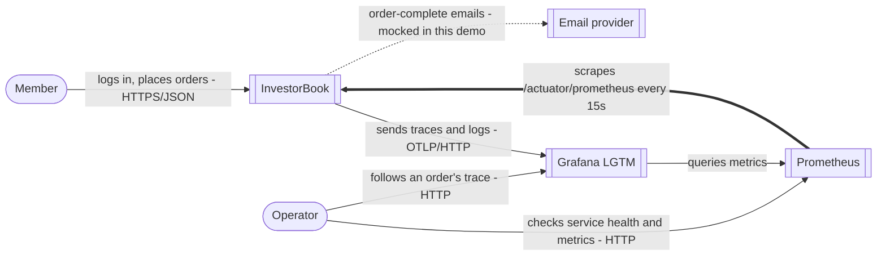
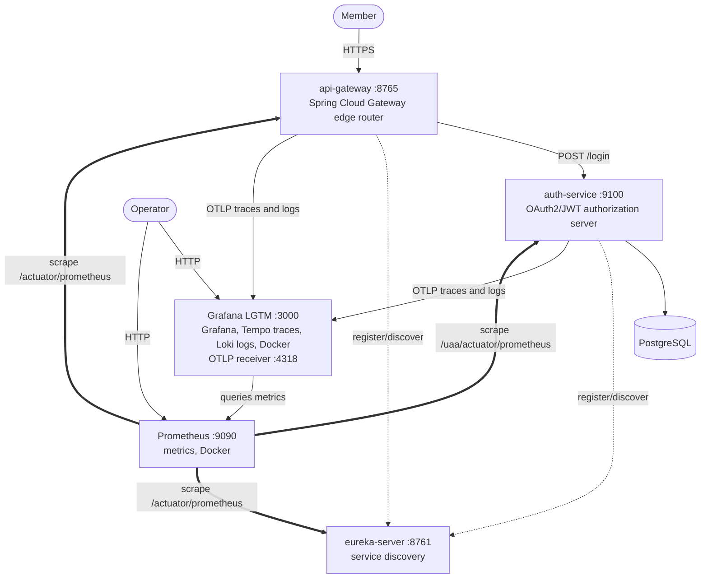
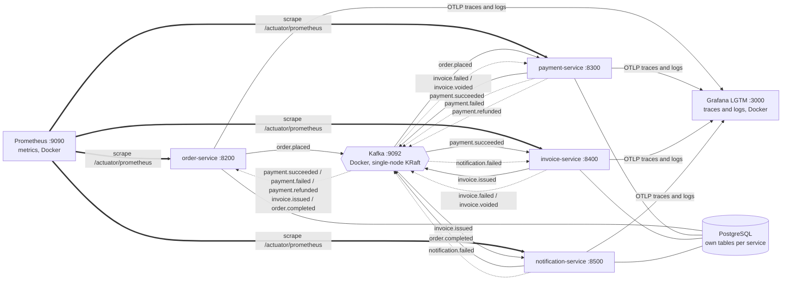
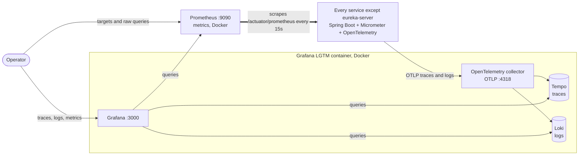
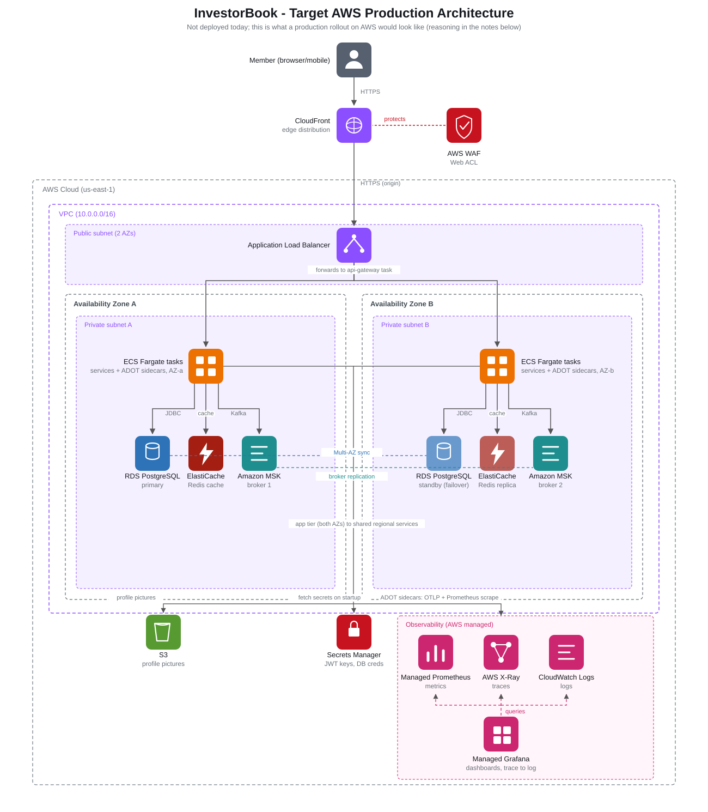

# InvestorBook

A Spring Cloud microservices demo built around a purchase-order system: service discovery, an
OAuth2/JWT authorization server, an API gateway, and a choreographed, event-driven purchase saga
over Kafka. Seven independently deployable modules plus a shared library, no parent POM.

Started as an untested prototype that didn't compile from a clean checkout. Now: real
integration tests (Testcontainers Postgres/Kafka), a hardened error/resilience layer, an
event-driven saga with compensating actions for every step, and a clean security scan across
every module. See [`CLAUDE.md`](CLAUDE.md) for full architecture detail, per-module quirks, and
commands; [`docs/adr/`](docs/adr/) for the decisions behind it.

## Architecture

### System context


```mermaid
graph LR
    Member([Member])
    Operator([Operator])
    System[[InvestorBook]]
    Email[[Email provider]]
    Prometheus[[Prometheus]]
    Grafana[[Grafana LGTM]]

    Member -->|logs in, places orders - HTTPS/JSON| System
    System -.->|order-complete emails - mocked in this demo| Email
    Operator -->|checks service health and metrics - HTTP| Prometheus
    Operator -->|follows an order's trace - HTTP| Grafana
    Prometheus ==>|scrapes /actuator/prometheus every 15s| System
    System -->|sends traces and logs - OTLP/HTTP| Grafana
    Grafana -->|queries metrics| Prometheus
```

### Containers, core services


```mermaid
graph TB
    Member([Member])
    GW["api-gateway :8765<br/>Spring Cloud Gateway edge router"]
    Auth["auth-service :9100<br/>OAuth2/JWT authorization server"]
    Eureka["eureka-server :8761<br/>service discovery"]
    DB[(PostgreSQL)]
    Prom["Prometheus :9090<br/>metrics, Docker"]
    LGTM["Grafana LGTM :3000<br/>Grafana, Tempo traces, Loki logs, Docker<br/>OTLP receiver :4318"]
    Operator([Operator])

    Member -->|HTTPS| GW
    GW -->|POST /login| Auth
    Auth --> DB
    GW -.->|register/discover| Eureka
    Auth -.->|register/discover| Eureka
    GW -->|OTLP traces and logs| LGTM
    Auth -->|OTLP traces and logs| LGTM
    LGTM -->|queries metrics| Prom
    Operator -->|HTTP| LGTM
    Operator -->|HTTP| Prom
    Prom ==>|scrape /actuator/prometheus| GW
    Prom ==>|scrape /uaa/actuator/prometheus| Auth
    Prom ==>|scrape /actuator/prometheus| Eureka
```

Eureka (Netflix OSS) is in maintenance mode; kept because it still works correctly and a new
service only needs `eureka.client.service-url.default-zone` pointed at it to register. See
[ADR-001](docs/adr/001-service-discovery-and-gateway.md) for the discovery/gateway reasoning and
`CLAUDE.md`'s "api-gateway" section for the reactive Spring Cloud Gateway architecture. A new
microservices system built today would still likely pair Spring Cloud Gateway with
Kubernetes-native discovery (DNS-based Service resolution) rather than Eureka.

Prometheus (started by the same `docker compose up -d`) scrapes every service's
`/actuator/prometheus` endpoint, the seven services in both diagrams, on a fixed list of static
targets rather than through Eureka. Open `http://localhost:9090/targets` to see which services are
up. See [ADR-011](docs/adr/011-prometheus-metrics.md).

The Grafana LGTM container in the same compose file receives OpenTelemetry traces and logs from
every service except `eureka-server`. One order is a single trace across the gateway, the four saga
services and every Kafka hop, browsable at `http://localhost:3000` (Explore, then the Tempo
datasource), and each log line carries the trace id, so a trace links to the log lines of every
service that took part (Explore, then the Loki datasource). The same Grafana has the standalone
Prometheus as a datasource. See [ADR-012](docs/adr/012-grafana-lgtm-tracing.md).

### Containers, event-driven purchase flow

Choreographed over Kafka, a single-node broker in KRaft mode (the `apache/kafka:3.7.0` Docker
image, port 9092, started via `docker compose up -d`); no service calls another directly, they
only publish/consume through it. See [ADR-005](docs/adr/005-event-driven-choreography.md) and
[ADR-006](docs/adr/006-kafka-vs-queue.md):


```mermaid
graph LR
    OrderSvc["order-service :8200"]
    PaymentSvc["payment-service :8300"]
    InvoiceSvc["invoice-service :8400"]
    NotifSvc["notification-service :8500"]
    Kafka{{"Kafka :9092<br/>Docker, single-node KRaft"}}
    DB[(PostgreSQL<br/>own tables per service)]
    Prom["Prometheus :9090<br/>metrics, Docker"]
    LGTM["Grafana LGTM :3000<br/>traces and logs, Docker"]

    OrderSvc & PaymentSvc & InvoiceSvc & NotifSvc -->|OTLP traces and logs| LGTM
    Prom ==>|scrape /actuator/prometheus| OrderSvc
    Prom ==>|scrape /actuator/prometheus| PaymentSvc
    Prom ==>|scrape /actuator/prometheus| InvoiceSvc
    Prom ==>|scrape /actuator/prometheus| NotifSvc

    OrderSvc -->|order.placed| Kafka
    Kafka -->|order.placed| PaymentSvc
    PaymentSvc -->|payment.succeeded| Kafka
    PaymentSvc -.->|payment.failed| Kafka
    Kafka -->|payment.succeeded| InvoiceSvc
    Kafka -.->|payment.succeeded / payment.failed / payment.refunded<br/>invoice.issued / order.completed| OrderSvc
    InvoiceSvc -->|invoice.issued| Kafka
    Kafka -->|invoice.issued| NotifSvc
    NotifSvc -->|order.completed| Kafka
    InvoiceSvc -.->|invoice.failed / invoice.voided| Kafka
    NotifSvc -.->|notification.failed| Kafka
    Kafka -.->|notification.failed| InvoiceSvc
    Kafka -.->|invoice.failed / invoice.voided| PaymentSvc
    PaymentSvc -.->|payment.refunded| Kafka

    OrderSvc --- DB
    PaymentSvc --- DB
    InvoiceSvc --- DB
    NotifSvc --- DB
```

Dashed edges are the compensation paths. When a step after payment fails, the saga unwinds
backwards instead of leaving the customer charged for an order that never completes:

```
invoice-service fails    InvoiceFailed -----------------------------> payment-service refunds --PaymentRefunded--> order CANCELLED
notification fails       NotificationFailed --> invoice-service voids --InvoiceVoided--> payment-service refunds --PaymentRefunded--> order CANCELLED
```

`order-service` consumes five topics (it tracks overall order status), `payment-service` three
(the order, plus the two events that mean a refund is due), `invoice-service` two, and
`notification-service` one.

### Monitoring architecture

Three signals, three routes, one Grafana. Metrics are pulled by Prometheus; traces and logs are
pushed by each service over OpenTelemetry (OTLP) to the Grafana LGTM container, which stores them
in Tempo and Loki. Grafana sits on top of all three:


```mermaid
graph LR
    Operator([Operator])
    App["Every service except eureka-server<br/>Spring Boot + Micrometer + OpenTelemetry"]
    Prom["Prometheus :9090<br/>metrics, Docker"]

    subgraph LGTM["Grafana LGTM container, Docker"]
        Collector["OpenTelemetry collector<br/>OTLP :4318"]
        Tempo[("Tempo<br/>traces")]
        Loki[("Loki<br/>logs")]
        Grafana["Grafana :3000"]
    end

    Prom ==>|scrapes /actuator/prometheus every 15s| App
    App -->|OTLP traces and logs| Collector
    Collector --> Tempo
    Collector --> Loki
    Grafana -->|queries| Tempo
    Grafana -->|queries| Loki
    Grafana -->|queries| Prom
    Operator -->|traces, logs, metrics| Grafana
    Operator -->|targets and raw queries| Prom
```

What ties the signals together: the gateway starts a trace for every request, the trace id travels
to each service in the HTTP headers and across Kafka in the record headers, and every log line
carries that `trace_id`. So from one order's trace, Grafana can jump to the log lines of every
service that took part. Health checks, Prometheus scrapes and Eureka traffic are filtered out of
tracing so they don't bury real requests. See [ADR-011](docs/adr/011-prometheus-metrics.md) for
metrics and [ADR-012](docs/adr/012-grafana-lgtm-tracing.md) for traces and logs.

Each piece has a managed AWS counterpart in the target deployment below, and the services'
own configuration does not change:

| Concern | Local | Target AWS |
|---|---|---|
| Collector | OpenTelemetry collector inside the LGTM container | ADOT (AWS Distro for OpenTelemetry) collector as a sidecar in every Fargate task |
| Metrics | Prometheus scraping `/actuator/prometheus` | The ADOT sidecar scrapes the task and remote-writes to Amazon Managed Service for Prometheus |
| Traces | Tempo | AWS X-Ray |
| Logs | Loki | CloudWatch Logs |
| Dashboards and search | Grafana in the LGTM container | Amazon Managed Grafana over all three |

Not covered yet: dashboards, alerting, and the Kafka broker itself (only the services' own
producer and consumer spans and logs are). The AWS column is a design, not something that has been
run on AWS.

### Target AWS deployment

Nothing here runs on AWS today; everything runs locally. This is what a production rollout would
map onto, across two Availability Zones, one AWS managed service per piece of local
infrastructure this repo already depends on, not a redesign (the diagram still shows S3, which
this system no longer uses - see ADR-009's note). The monitoring stack maps the same way: an ADOT
collector sidecar in each Fargate task feeding X-Ray, CloudWatch Logs and Amazon Managed
Prometheus, with Amazon Managed Grafana on top (see "Monitoring architecture" above):



Fargate over EKS, one Multi-AZ RDS instance over per-service databases, MSK over self-hosted
Kafka, CloudFront+WAF at the edge, why 2 AZs: the reasoning behind each is in
[ADR-009](docs/adr/009-aws-deployment-architecture.md), including what this diagram deliberately
doesn't claim (no auto-scaling policy, no multi-region failover, no CI/CD pipeline).

## Highlights

- **A shared error handler with a real, hidden bug**: wiring it into every service surfaced a
  catch-all that was silently turning every `@PreAuthorize` denial into a 500 instead of a 403,
  fixed, and proven with a regression test.
- **A saga with real compensating actions**: a declined payment cancels the order rather than
  leaving it stuck, and a failure after payment (invoice not issued, customer unreachable) voids
  the invoice, refunds the payment, and cancels the order. See
  [ADR-008](docs/adr/008-saga-compensation.md) and [ADR-010](docs/adr/010-compensation-after-payment.md).
- **Idempotent consumers, two different ways**, each proven against a real duplicate delivery.
  See [ADR-007](docs/adr/007-idempotency-strategy.md).
- **A security scan that found real bugs**: wiring SpotBugs/FindSecBugs into every module (it was
  only in one) turned up a mutable `Date` exposed by reference, a default-encoding footgun in an
  OAuth2 Basic-auth header, CRLF log-injection on Kafka payload fields, and more, fixed, not
  suppressed. Full list in `CLAUDE.md`'s "Security scanning" section.
- **A rate limiter that initially rate-limited nothing**: wired in first as a Gateway-scoped
  filter (matching the request-logging filter's own pattern), it passed its own unit test but let
  a real HTTP burst straight through - that kind of filter only runs for requests actually
  proxied to a downstream service, never the gateway's own local endpoints like
  `/actuator/health`. The exact same class of gap `CorsConfig` already hit for CORS, found the
  same way: by testing the real request, not the filter in isolation. Fixed by registering it as
  a plain `WebFilter` instead, which applies to every request regardless of routing, proven live
  against a running instance and by `RateLimitFilterIT` over a real HTTP round trip.
- **`api-gateway` runs on a reactive (WebFlux/Netty) stack**, Spring Boot 4.1.1/Spring Cloud
  2025.1.2 - the one module on a different generation from the rest of this repo, deliberately.
  Building it surfaced a second real bug beyond the rate limiter: `/actuator/health` briefly
  404'd (Actuator wasn't declared as an explicit dependency) and that 404 was then masked as a
  500 by a too-broad exception handler - the identical "generic handler hides a specific status"
  class of bug this repo's shared error handler exists to prevent, rediscovered in the reactive
  stack. See `CLAUDE.md`'s "api-gateway" section for the full architecture.

## Services

| Service | Port | Purpose |
|---|---|---|
| `eureka-server` | 8761 | Service discovery |
| `auth-service` | 9100 | OAuth2/JWT authorization server |
| `api-gateway` | 8765 | Spring Cloud Gateway edge router, the only externally-called service |
| `order-service` | 8200 | Places orders, owns order status (including `CANCELLED` after a refund); also owns the product catalog (`GET /products`) |
| `payment-service` | 8300 | Mocked, deterministic payment decision; refunds when a later step fails |
| `invoice-service` | 8400 | Generates an invoice on successful payment; voids it if notification fails |
| `notification-service` | 8500 | Emails (mocked) the customer, closes the saga |
| `common` | n/a | Shared DTOs, events, error handling (not a service) |
| Kafka | 9092 | Event bus for the purchase-flow saga (`docker compose up -d`, not a service) |
| Prometheus | 9090 | Scrapes every service's `/actuator/prometheus` (`docker compose up -d`, not a service) |
| Grafana LGTM | 3000 | Grafana UI plus Tempo (traces) and Loki (logs), OTLP receiver on 4318 (`docker compose up -d`, not a service) |
| `frontend` | 5173 | React storefront (Vite dev server), calls `api-gateway` directly over CORS - not a Maven module |

## Accounts

There is no signup flow - `auth-service` seeds one fixed demo account on startup instead
(`DemoMemberSeeder`, `demo@investorbook.com` / `demo12345`, idempotent on restart, the same
pattern `order-service`'s `ProductCatalogSeeder` uses for the product catalog). There's no way to
create additional accounts - a known, named gap, not a hidden one.

## What's covered, honestly

- **Tested and green**: every module except `eureka-server` (nothing to test there), unit tests,
  real Postgres/S3/Kafka integration tests via Testcontainers/LocalStack, full HTTP+security
  end-to-end tests. `mvn verify` is clean, including SpotBugs/FindSecBugs, on all seven.
- **Not done**: OWASP Dependency-Check has never completed a run here (no NVD API key, so the first
  sync is too slow); no CI.
- **Metrics, traces and logs, but not a finished monitoring setup**: Prometheus scrapes every
  service, Grafana shows one trace per order across the whole saga, and every service's logs are in
  Loki, linked to the trace. There are no Grafana dashboards, no alerting, and the Kafka broker
  itself is not monitored. See [ADR-011](docs/adr/011-prometheus-metrics.md) and
  [ADR-012](docs/adr/012-grafana-lgtm-tracing.md).
- **Demo-scale on purpose**: one shared Postgres instance (see [ADR-004](docs/adr/004-per-service-data-ownership.md)),
  one checked-in demo RSA keypair (env-overridable), mocked payment and email. See the ADRs for
  what a production version of each would do differently.

## REST API design checklist

An API is exposed to the world, and everything a client can send it is part of its attack
surface. Working through this repo mapped onto a standard checklist of what protects a REST
API; most points are actually implemented here, and the honest gaps are named rather than
glossed over.

1. **Authentication** - proves who is calling. Username/password + a signed JWT (see "Security
   model" above, and [ADR-002](docs/adr/002-oauth2-authentication.md) for why this isn't OAuth2):
   `auth-service` signs a JWT directly with its RSA private key, every other service verifies it
   with the public key via a `JwtDecoder`-backed `oauth2ResourceServer()` chain, stateless
   (`SessionCreationPolicy.STATELESS`), default-deny except an explicit permit list
   (`order-service/src/main/java/com/investorbook/orderservice/security/SecurityConfiguration.java`):
   ```java
   @Bean
   SecurityFilterChain securityFilterChain(HttpSecurity http, JwtAuthenticationConverter jwtAuthenticationConverter)
           throws Exception {
       return http.csrf(csrf -> csrf.disable())
               .authorizeHttpRequests(auth -> auth.requestMatchers("/actuator/**", "/products", "/products/**")
                       .permitAll().anyRequest().authenticated())
               .sessionManagement(session -> session.sessionCreationPolicy(SessionCreationPolicy.STATELESS))
               .oauth2ResourceServer(
                       oauth2 -> oauth2.jwt(jwt -> jwt.jwtAuthenticationConverter(jwtAuthenticationConverter)))
               .build();
   }
   ```
   The authenticated caller's identity is read back off the JWT's `user_name` claim, never
   trusted from the request body (`common/src/main/java/com/investorbook/common/util/JwtUtil.java`).

2. **Authorization** - decides what an authenticated caller can access. Method-level
   `@PreAuthorize` on every write endpoint, and the request never lets a caller act as anyone
   but themselves (`order-service/src/main/java/com/investorbook/orderservice/controller/OrderController.java`):
   ```java
   // customerEmail comes from the authenticated JWT, never the request body -
   // a client can only ever place an order as themselves.
   @PostMapping("/orders")
   @PreAuthorize("hasRole('MEMBER')")
   public ResponseEntity<OrderResponse> placeOrder(@Valid @RequestBody PlaceOrderRequest request) {
       OrderEntity order = new OrderEntity(UUID.randomUUID().toString(), currentEmail(), request.getAmount(), ...);
   ```

3. **Rate Limiting** - caps how many requests a client can make. A per-client-IP resilience4j
   `RateLimiter` at `api-gateway`, the one edge every external call passes through
   (`api-gateway/src/main/java/com/investorbook/apigateway/filters/RateLimitFilter.java`):
   ```java
   RateLimiter limiter = registry.rateLimiter(clientKey);
   if (limiter.acquirePermission()) {
       return chain.filter(exchange);
   }
   return reject(clientKey, exchange.getResponse());
   ```
   Registered as a plain `WebFilter` ahead of Spring Security's chain (not a Gateway
   `GlobalFilter`, which never runs for this gateway's own locally-handled endpoints like
   `/login`/`/actuator/**`), so it applies uniformly even to routes a `permitAll()` rule bypasses
   security for entirely. A rejected request gets a 429 with a `Retry-After` header and the same
   `{timestamp, message, details}` error shape as everywhere else in this system (see "Error
   Hygiene" below). In-memory and keyed by remote address, so it doesn't share state across a
   horizontally-scaled deployment - fine for a demo, not for real internet traffic. See the
   class's own Javadoc for the full list.

4. **Input Validation** - rejects malformed input at the boundary. Bean Validation
   (`jakarta.validation`/`javax.validation`) annotations on every request DTO, enforced by
   `@Valid` at the controller (`common/src/main/java/com/investorbook/common/dto/AuthRequest.java`):
   ```java
   @NotNull(message = "username cannot be null")
   private String username;

   @Size(min = 6, message = "password must be at least 6 char long")
   @NotNull(message = "password cannot be null")
   private String password;
   ```
   This one was a real, present-tense bug: `AuthRequest`'s constraints existed but were never
   enforced until `@Valid` was actually added to `LoginService.login` - see "Shared error
   handling" in `CLAUDE.md`.

5. **Output Encoding** - stops untrusted data being interpreted as markup in the response.
   **Not something this repo's own code does explicitly** - every API response is JSON (no
   server-rendered HTML to escape), and the `frontend` React app gets JSX's default escaping for
   free (no `dangerouslySetInnerHTML` anywhere in `frontend/src`). No CSP or
   `X-Content-Type-Options` headers are set at the gateway; that would be the next real gap to
   close if this went to production.

6. **HTTPS Everywhere** - encrypts data in transit. **Not configured anywhere locally** - every
   service runs plain HTTP on localhost. The target deployment terminates TLS at
   CloudFront/the ALB, in front of every service (`docs/adr/009-aws-deployment-architecture.md`),
   rather than each of the seven Spring Boot apps managing its own certificate.

7. **Secret Rotation** - limits the blast radius when a credential leaks. Every secret that used
   to be a literal in `application.properties` is now `${ENV_VAR:same-literal-as-before}` - the
   default preserves today's dev behavior with nothing set, but a real deployment overrides it
   without touching source (`auth-service/src/main/resources/application.properties`):
   ```properties
   spring.datasource.password=${DB_PASSWORD:pass}
   investorbook.security.jwt.public.key=${JWT_PUBLIC_KEY:-----BEGIN PUBLIC KEY-----...}
   ```
   This makes rotation *possible* (change the env var, redeploy) - it doesn't rotate anything
   automatically, and the same public key is still duplicated as the fallback literal across
   every service's `application.properties` (see "Config & secrets" in `CLAUDE.md`).

8. **Least Privilege** - each identity gets only the permissions it needs. `auth-service` grants
   tiered `GrantedAuthority` lists rather than one blanket role, even though only the lowest tier
   is ever assigned today (`auth-service/src/main/java/com/investorbook/authservice/security/GrantedAuthorities.java`):
   ```java
   case NORMAL_USER:
       return AuthorityUtils.createAuthorityList("ROLE_MEMBER");
   case PREMIUM_USER:
       return AuthorityUtils.createAuthorityList("ROLE_MEMBER", "ROLE_PREMIUMMEMBER");
   default: // ADMIN
       return AuthorityUtils.createAuthorityList("ROLE_MEMBER", "ROLE_PREMIUMMEMBER", "ROLE_ADMIN");
   ```
   Same principle at the route level: `WebSecurity.ignoring()` opens up only the specific paths
   that must be public (`/products`, `/actuator/**`, `/login`), never a whole service.

9. **Idempotency Keys** - stops a retried request from double-executing. This repo's version is
   consumer-side, not a client-supplied header: every purchase-flow service that has no other
   state to dedupe on keeps a `processed_events` table keyed by event id, inserted with a flush
   before any further side effect
   (`payment-service/src/main/java/com/investorbook/paymentservice/dao/entities/ProcessedEvent.java`):
   ```java
   // Implements Persistable so Spring Data always attempts a real INSERT (isNew() always true)
   // instead of a merge - a duplicate id must fail the insert, not silently succeed as an update.
   @Override
   public boolean isNew() {
       return true;
   }
   ```
   `order-service` uses a different mechanism for the same goal - a state-machine guard, since it
   already has an order status to check against (see "Idempotency" in `CLAUDE.md`). What's
   missing is the REST-level version of this (an `Idempotency-Key` header on `POST /orders` so a
   retried HTTP request doesn't place two orders) - not built here.

10. **Audit Logging** - records who did what, when. `order-service` persists one row per saga
    event to a real table, not just console log text, purpose-built for the dashboard's
    per-order timeline (`order-service/src/main/java/com/investorbook/orderservice/service/OrderEventLogRecorder.java`):
    ```java
    public void record(String orderId, String eventType, String message) {
        repository.save(new OrderEventLogEntity(orderId, eventType, message, Instant.now()));
    }
    ```
    Every Kafka listener across the saga also sanitizes attacker-influenced fields (order/event
    ids come off the wire from whatever produced the event) before they reach a log line, closing
    a CRLF log-injection finding SpotBugs/FindSecBugs turned up
    (`invoice-service/src/main/java/com/investorbook/invoiceservice/service/InvoiceEventListener.java`):
    ```java
    logger.info("saga: PaymentSucceeded for order {}, issued invoice {}, publishing InvoiceIssued",
            sanitizeForLog(event.getOrderId()), invoiceNumber);
    ```

11. **Dependency Scans** - finds known CVEs in third-party packages. OWASP Dependency-Check is
    declared in every module's `pom.xml` (deliberately not bound to a lifecycle phase - see
    below), alongside SpotBugs+FindSecBugs for static analysis, which *is* bound to `verify` and
    runs on every build (`order-service/pom.xml`):
    ```xml
    <!-- CVE scan of dependencies against the NVD. Deliberately NOT bound to a lifecycle phase:
         without an NVD_API_KEY the first sync can take hours (public API rate limits). -->
    <plugin>
        <groupId>org.owasp</groupId>
        <artifactId>dependency-check-maven</artifactId>
        <configuration>
            <failBuildOnCVSS>7</failBuildOnCVSS>
        </configuration>
    </plugin>
    ```
    Honestly: this has never completed a run on this machine (no `NVD_API_KEY`), so it's wired in
    but unproven - see "What's covered, honestly" above.

12. **Error Hygiene** - don't leak stack traces, internal paths, or SQL details to a caller. One
    `@ControllerAdvice`, shared via `common`, maps every uncaught exception to a uniform
    `{timestamp, message, details}` 500 instead of a raw stack trace, while still letting Spring
    Security's own 401/403 handling through
    (`common/src/main/java/com/investorbook/common/exception/CustomizedResponseEntityExceptionHandler.java`):
    ```java
    @ExceptionHandler(Exception.class)
    public final ResponseEntity<Object> handleAllExceptions(Exception ex, WebRequest request) {
        ExceptionResponse exceptionResponse = new ExceptionResponse(new Date(), ex.getMessage(),
                request.getDescription(false));
        return new ResponseEntity<>(exceptionResponse, HttpStatus.INTERNAL_SERVER_ERROR);
    }

    // Without these, the catch-all above intercepts @PreAuthorize denials and authentication
    // failures before Spring Security's own filter chain ever sees them - turning every 403/401
    // into a 500. Rethrowing lets Spring Security handle them as normal.
    @ExceptionHandler(AccessDeniedException.class)
    public ResponseEntity<Object> handleAccessDenied(AccessDeniedException ex) throws AccessDeniedException {
        throw ex;
    }
    ```
    Wiring this into every service (it used to live only in `member-service`) is what caught the
    403-became-500 bug called out in "Highlights" above - a real defect this checklist item
    surfaced, not a hypothetical one. One honest caveat: `ex.getMessage()` still flows into the
    response body, so it's shaped consistently but not scrubbed of internal detail - fine for
    this demo, worth tightening before a real deployment.

## Running it

```bash
cd common && mvn clean install                 # build the shared library first
docker compose up -d                           # Kafka (purchase-flow services), Prometheus, Grafana LGTM
# start eureka-server, auth-service, api-gateway, then the four purchase-flow services,
# each via:
cd <service-dir> && mvn spring-boot:run

cd frontend && npm install && npm run dev     # storefront UI, once api-gateway is up
```

Once everything is up:

| What | URL |
|---|---|
| Prometheus targets (start here, all seven should be `UP`) | http://localhost:9090/targets |
| Prometheus query UI | http://localhost:9090/graph |
| Grafana (traces and metrics, login `admin` / `admin`) | http://localhost:3000 |
| Eureka dashboard (registered services) | http://localhost:8761 |
| API gateway (the only externally-called service) | http://localhost:8765 |
| Storefront | http://localhost:5173 |

Full startup order, required Postgres setup, and per-module test commands are in
[`CLAUDE.md`](CLAUDE.md#commands).

## How this was built

Built as an agentic Claude Code session, using three of my own skills (checked in at
[`.claude/skills/`](.claude/skills/)) that encode a fixed discipline: reproduce with a failing
test before touching code, never reach green by weakening a test, run a security scan before
calling anything done. `bugfix-workflow`, `integration-test-loop`, and `owasp-java-check`, each
is an agent instruction set, not a guarantee; the judgment calls throughout were made by
reviewing what the agent actually produced, not by trusting a green checkmark.
